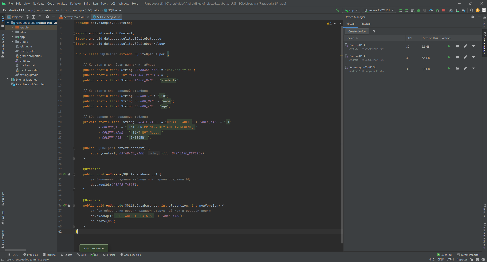
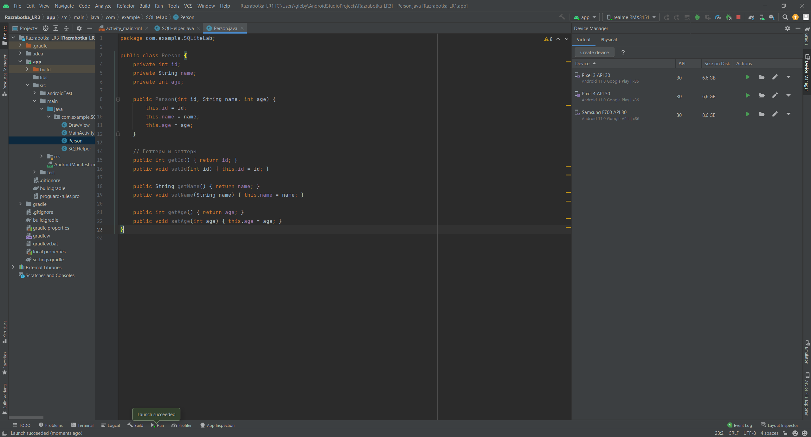
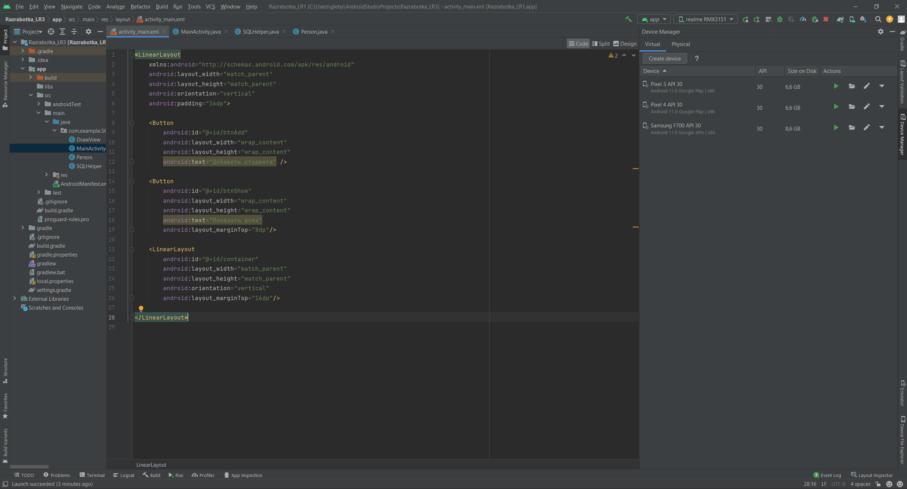
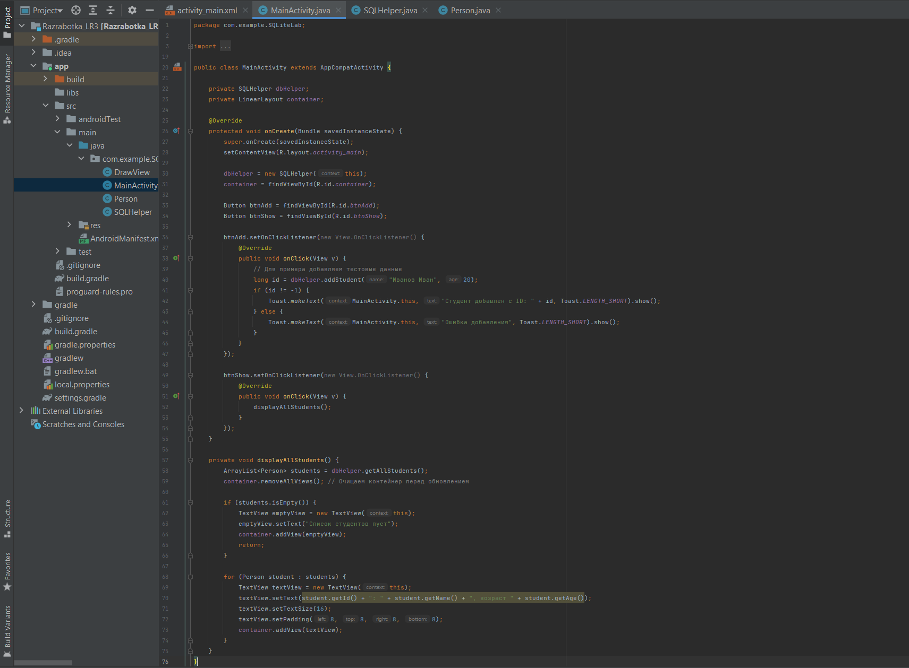
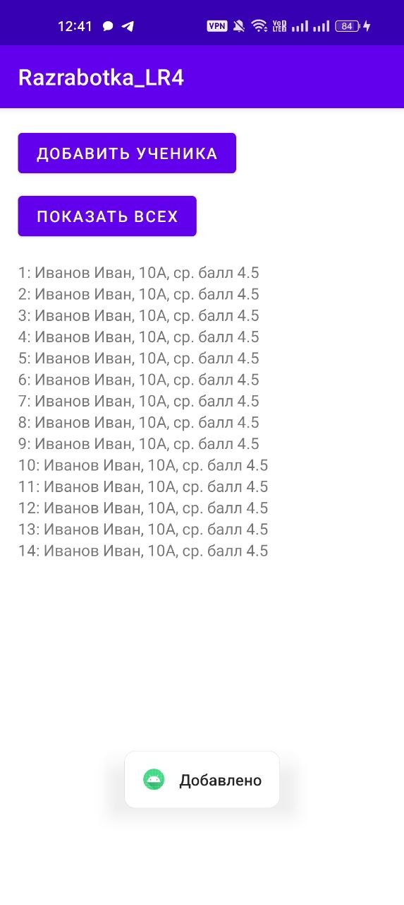

<div align="center">

# Отчет

</div>

<div align="center">

## Практическая работа №4

</div>

<div align="center">

## Работа с встроенной базой данных SQLite

</div>

**Выполнил:**  
Ржевский Константин Романович
**Курс:** 2  
**Группа:** ИНС-б-о-24-1

**Проверил:**   
Потапов И.Р. 

---

### Цель работы

Изучить основы работы с СУБД SQLite в Android-приложениях. Научиться создавать базу данных, таблицы, выполнять основные операции CRUD (Create, Read, Update, Delete) с использованием класса SQLiteOpenHelper и отображать данные на экране.

### Ход работы
1. Создадим класс-помощник SQLHelper.

<div align="center">



*Рисунок 1. Код класса-помощника SQLHelper*

</div>

2. Создадим модели данных Person.

<div align="center">



</div>

<div align="center">

*Рисунок 2. Код модели данных Person*

</div>

3.  Реализуем методы для работы с данными в SQLHelper.
Добавим в класс SQLHelper методы для выполнения CRUD операций.

<pre>
package com.example.SQLiteLab;

import android.content.ContentValues;
import android.content.Context;
import android.database.Cursor;
import android.database.sqlite.SQLiteDatabase;
import android.database.sqlite.SQLiteOpenHelper;

import java.util.ArrayList;

public class SQLHelper extends SQLiteOpenHelper {

    // Константы для базы данных и таблицы
    public static final String DATABASE_NAME = "university.db";
    public static final int DATABASE_VERSION = 1;
    public static final String TABLE_NAME = "students";

    // Константы для названий столбцов
    public static final String COLUMN_ID = "_id";
    public static final String COLUMN_NAME = "name";
    public static final String COLUMN_AGE = "age";

    // SQL запрос для создания таблицы
    private static final String CREATE_TABLE = "CREATE TABLE " + TABLE_NAME + " ("
            + COLUMN_ID + " INTEGER PRIMARY KEY AUTOINCREMENT, "
            + COLUMN_NAME + " TEXT NOT NULL, "
            + COLUMN_AGE + " INTEGER);";

    public SQLHelper(Context context) {
        super(context, DATABASE_NAME, null, DATABASE_VERSION);
    }

    @Override
    public void onCreate(SQLiteDatabase db) {
        // Выполняем создание таблицы при первом создании БД
        db.execSQL(CREATE_TABLE);
    }

    @Override
    public void onUpgrade(SQLiteDatabase db, int oldVersion, int newVersion) {
        // При обновлении версии удаляем старую таблицу и создаём новую
        db.execSQL("DROP TABLE IF EXISTS " + TABLE_NAME);
        onCreate(db);
    }

    public long addStudent(String name, int age) {
        SQLiteDatabase db = this.getWritableDatabase();
        ContentValues values = new ContentValues();
        values.put(COLUMN_NAME, name);
        values.put(COLUMN_AGE, age);
        long id = db.insert(TABLE_NAME, null, values);
        db.close();
        return id;
    }

    public ArrayList<Person> getAllStudents() {
        ArrayList<Person> studentList = new ArrayList<>();
        String selectQuery = "SELECT * FROM " + TABLE_NAME;
        SQLiteDatabase db = this.getReadableDatabase();
        Cursor cursor = db.rawQuery(selectQuery, null);

        if (cursor.moveToFirst()) {
            do {
                int id = cursor.getInt(cursor.getColumnIndex(COLUMN_ID));
                String name = cursor.getString(cursor.getColumnIndex(COLUMN_NAME));
                int age = cursor.getInt(cursor.getColumnIndex(COLUMN_AGE));
                studentList.add(new Person(id, name, age));
            } while (cursor.moveToNext());
        }
        cursor.close();
        db.close();
        return studentList;
    }

    public int updateStudent(Person person) {
        SQLiteDatabase db = this.getWritableDatabase();
        ContentValues values = new ContentValues();
        values.put(COLUMN_NAME, person.getName());
        values.put(COLUMN_AGE, person.getAge());
        return db.update(TABLE_NAME, values, COLUMN_ID + " = ?",
                new String[]{String.valueOf(person.getId())});
    }

    public void deleteStudent(int id) {
        SQLiteDatabase db = this.getWritableDatabase();
        db.delete(TABLE_NAME, COLUMN_ID + " = ?",
                new String[]{String.valueOf(id)});
        db.close();
    }
}
</pre>

4. Проработаем базу данных в MainActivity.


<div align="center">



*Рисунок 3. Код XML*

</div>

<div align="center">



*Рисунок 4. Код Java*

</div>

<div align="center">


*Рисунок 5. Результат*

</div>

<div align="center">

## ИНДИВИДУАЛЬНОЕ ЗАДАНИЕ

</div>

5. Возьмём вариант 2.

Нужно создать школу: ученик (ФИО, класс, буква класса, средняя оценка).

Создадим файл Student.Java и пропишем в нём следующий код:

<pre> 
package com.example.SQLiteLab;

public class Student {
    // Поля класса (соответствуют столбцам таблицы)
    private int id;
    private String name;
    private int classNum;
    private String letter;
    private double grade;

    public Student(int id, String name, int classNum, String letter, double grade) {
        this.id = id;
        this.name = name;
        this.classNum = classNum;
        this.letter = letter;
        this.grade = grade;
    }

    // Получение данных
    public int getId() { return id; }
    public String getName() { return name; }
    public int getClassNum() { return classNum; }
    public String getLetter() { return letter; }
    public double getGrade() { return grade; }

    public void setGrade(double grade) { this.grade = grade; }
}
</pre>

В файле MainActivity.Java пропишем код:

<pre> 
package com.example.SQLiteLab;

import android.os.Bundle;
import android.view.View;
import android.widget.*;
import androidx.appcompat.app.AppCompatActivity;

import com.example.razrabotka_lr1.R;

import java.util.ArrayList;

public class MainActivity extends AppCompatActivity {

    // Объект для работы с БД
    private SQLHelper dbHelper;
    // Контейнер для вывода списка
    private LinearLayout container;

    @Override
    protected void onCreate(Bundle savedInstanceState) {
        super.onCreate(savedInstanceState);

        // Устанавливаем разметку
        setContentView(R.layout.activity_main);

        // Инициализируем БД
        dbHelper = new SQLHelper(this);
        // Находим контейнер
        container = findViewById(R.id.container);

        // Находим кнопки
        Button btnAdd = findViewById(R.id.btnAdd);
        Button btnShow = findViewById(R.id.btnShow);

        btnAdd.setOnClickListener(new View.OnClickListener() {
            @Override
            public void onClick(View v) {
                dbHelper.addStudent("Иванов Иван", 10, "А", 4.5);
                Toast.makeText(MainActivity.this, "Добавлено", Toast.LENGTH_SHORT).show();
            }
        });

        btnShow.setOnClickListener(new View.OnClickListener() {
            @Override
            public void onClick(View v) {
                showStudents();
            }
        });
    }

    private void showStudents() {
        // Очищаем контейнер перед выводом
        container.removeAllViews();

        // Получаем список из БД
        ArrayList<Student> list = dbHelper.getAllStudents();

        // Проходим по всем ученикам
        for (final Student s : list) {

            // Создаём TextView для каждого ученика
            TextView tv = new TextView(this);

            tv.setText(s.getId() + ": " + s.getName() +
                    ", " + s.getClassNum() + s.getLetter() +
                    ", ср. балл " + s.getGrade());

            // УДАЛЕНИЕ (долгое нажатие)
            tv.setOnLongClickListener(new View.OnLongClickListener() {
                @Override
                public boolean onLongClick(View v) {
                    dbHelper.deleteStudent(s.getId());
                    showStudents(); // обновляем список
                    return true;
                }
            });

            // Добавляем элемент в контейнер
            container.addView(tv);
        }
    }
}
</pre>

В файле SQLHelper.Java пропишем код:

<pre> 
package com.example.SQLiteLab;

import android.content.ContentValues;
import android.content.Context;
import android.database.Cursor;
import android.database.sqlite.SQLiteDatabase;
import android.database.sqlite.SQLiteOpenHelper;

import java.util.ArrayList;

public class SQLHelper extends SQLiteOpenHelper {

    // Название базы данных
    public static final String DATABASE_NAME = "school.db";
    public static final int DATABASE_VERSION = 1;
    // Название таблицы
    public static final String TABLE_NAME = "students";

    // Названия столбцов таблицы
    public static final String COLUMN_ID = "_id";
    public static final String COLUMN_NAME = "name";
    public static final String COLUMN_CLASS = "class_num";
    public static final String COLUMN_LETTER = "letter";
    public static final String COLUMN_GRADE = "grade";

    private static final String CREATE_TABLE = "CREATE TABLE " + TABLE_NAME + " ("
            + COLUMN_ID + " INTEGER PRIMARY KEY AUTOINCREMENT, "
            + COLUMN_NAME + " TEXT, "
            + COLUMN_CLASS + " INTEGER, "
            + COLUMN_LETTER + " TEXT, "
            + COLUMN_GRADE + " REAL);";

    public SQLHelper(Context context) {
        super(context, DATABASE_NAME, null, DATABASE_VERSION);
    }

    @Override
    public void onCreate(SQLiteDatabase db) {
        db.execSQL(CREATE_TABLE);
    }

    @Override
    public void onUpgrade(SQLiteDatabase db, int oldVersion, int newVersion) {
        db.execSQL("DROP TABLE IF EXISTS " + TABLE_NAME);
        onCreate(db);
    }

    // Добавление нового ученика в таблицу
    public long addStudent(String name, int classNum, String letter, double grade) {
        SQLiteDatabase db = this.getWritableDatabase();
        ContentValues values = new ContentValues();

        values.put(COLUMN_NAME, name);
        values.put(COLUMN_CLASS, classNum);
        values.put(COLUMN_LETTER, letter);
        values.put(COLUMN_GRADE, grade);

        long id = db.insert(TABLE_NAME, null, values);
        db.close();
        return id;
    }

    // Получаем все записи из таблицы
    public ArrayList<Student> getAllStudents() {
        ArrayList<Student> list = new ArrayList<>();

        // Получаем доступ к базе данных для чтения
        SQLiteDatabase db = this.getReadableDatabase();
        Cursor cursor = db.rawQuery("SELECT * FROM " + TABLE_NAME, null);

        // Проверяем, есть ли данные
        if (cursor.moveToFirst()) {
            do {
                // Считываем данные из текущей строки
                int id = cursor.getInt(cursor.getColumnIndex(COLUMN_ID));
                String name = cursor.getString(cursor.getColumnIndex(COLUMN_NAME));
                int classNum = cursor.getInt(cursor.getColumnIndex(COLUMN_CLASS));
                String letter = cursor.getString(cursor.getColumnIndex(COLUMN_LETTER));
                double grade = cursor.getDouble(cursor.getColumnIndex(COLUMN_GRADE));

                // Добавляем объект в список
                list.add(new Student(id, name, classNum, letter, grade));
            } while (cursor.moveToNext());
        }

        cursor.close();
        db.close();
        return list;
    }

    // Обновление данных ученика
    public int updateStudent(Student s) {
        SQLiteDatabase db = this.getWritableDatabase();
        ContentValues values = new ContentValues();

        values.put(COLUMN_NAME, s.getName());
        values.put(COLUMN_CLASS, s.getClassNum());
        values.put(COLUMN_LETTER, s.getLetter());
        values.put(COLUMN_GRADE, s.getGrade());

        return db.update(TABLE_NAME, values, COLUMN_ID + "=?",
                new String[]{String.valueOf(s.getId())});
    }

    // Удаление ученика по ID
    public void deleteStudent(int id) {
        SQLiteDatabase db = this.getWritableDatabase();
        db.delete(TABLE_NAME, COLUMN_ID + "=?",
                new String[]{String.valueOf(id)});
        db.close();
    }
}
</pre>

Пропишем код в файле activity_main.xml:

```xml
<LinearLayout
    xmlns:android="http://schemas.android.com/apk/res/android"
    android:layout_width="match_parent"
    android:layout_height="match_parent"
    android:orientation="vertical"
    android:padding="16dp">

    <Button
        android:id="@+id/btnAdd"
        android:layout_width="wrap_content"
        android:layout_height="wrap_content"
        android:text="Добавить ученика" />

    <Button
        android:id="@+id/btnShow"
        android:layout_width="wrap_content"
        android:layout_height="wrap_content"
        android:text="Показать всех"
        android:layout_marginTop="8dp"/>

    <LinearLayout
        android:id="@+id/container"
        android:layout_width="match_parent"
        android:layout_height="match_parent"
        android:orientation="vertical"
        android:layout_marginTop="16dp"/>

</LinearLayout>
```

Запустим файл MainActivity.Java и посмотрим результат:

<div align="center">



*Рисунок 6. Результат кода по индивидуальному заданию*

</div>

### Вывод
В результате выполнения практической работы были изучены основы работы с встроенной базой данных SQLite в среде Android Studio. Освоено создание и подключение базы данных с использованием класса SQLiteOpenHelper, а также создание таблиц и управление их структурой.
### Ответы на контрольные вопросы
1.  **Вопрос 1: Какие типы данных поддерживает SQLite? Как в SQLite можно хранить логические значения и даты?** 
SQLite поддерживает следующие типы данных: NULL, INTEGER, REAL, TEXT, BLOB и NUMERIC. Логические значения в SQLite обычно хранятся как целые числа, где 1 означает true, а 0 — false. Даты можно хранить в виде строки (TEXT) в формате даты, в виде целого числа (INTEGER) как Unix-время или в виде числа с плавающей точкой (REAL).
2.  **Вопрос 2: Для чего нужен класс SQLiteOpenHelper? Опишите назначение методов onCreate() и onUpgrade().**
Класс SQLiteOpenHelper нужен для создания и управления базой данных в приложении. Метод onCreate() вызывается при первом создании базы данных и используется для создания таблиц, а метод onUpgrade() вызывается при изменении версии базы данных и применяется для обновления её структуры.
3.  **Вопрос 3: В чем разница между методами getWritableDatabase() и getReadableDatabase()? В каких ситуациях может возникнуть ошибка при вызове getWritableDatabase()?**
Метод getWritableDatabase() предоставляет доступ к базе данных для чтения и записи, а getReadableDatabase() — только для чтения. Ошибка при вызове getWritableDatabase() может возникнуть, например, если на устройстве недостаточно памяти или база данных временно недоступна, в таком случае система может вернуть доступ только для чтения.
4. **Вопрос 4: Что такое Cursor? Как правильно перемещаться по его элементам и почему важно закрывать его после использования?**
Cursor — это объект, который содержит результат выполнения SQL-запроса и позволяет перемещаться по строкам результата. Перемещение осуществляется с помощью методов moveToFirst() и moveToNext(). После использования Cursor необходимо закрывать, чтобы освободить ресурсы и избежать утечек памяти.
5. **Вопрос 5: Что такое ContentValues и для каких операций он применяется?** 
ContentValues — это специальный класс для хранения данных в виде пар «ключ-значение», который используется при добавлении и обновлении записей в базе данных.
6. **Вопрос 6: В чем отличие методов query() и rawQuery()? Приведите пример использования rawQuery() с параметром-плейсхолдером (?).** 
Метод query() предоставляет удобный способ выполнения запросов без написания SQL-кода, тогда как rawQuery() позволяет выполнять SQL-запросы напрямую. Например, с использованием плейсхолдера можно написать запрос rawQuery("SELECT * FROM students WHERE age > ?", new String[]{"18"}).
7. **Вопрос 7: Как обработать ситуацию, когда таблица уже существует, но её структура была изменена (например, добавлено новое поле)?** 
Если структура таблицы изменилась, это обрабатывается в методе onUpgrade(), где можно удалить старую таблицу и создать новую или изменить её с помощью SQL-команд, например через ALTER TABLE.
